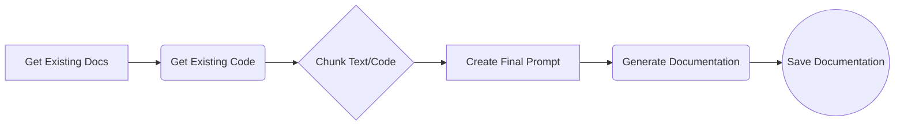
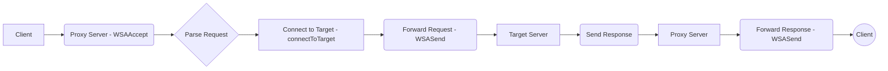
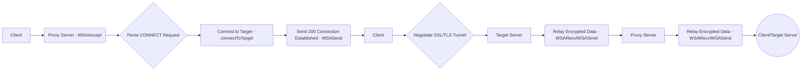
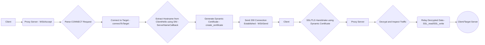
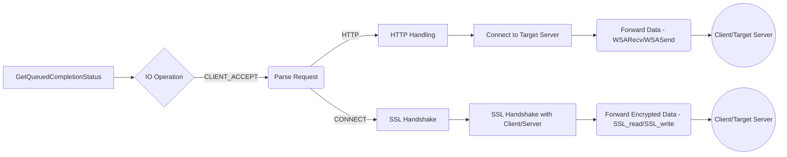
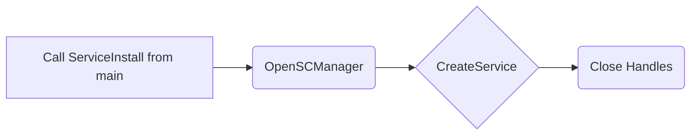
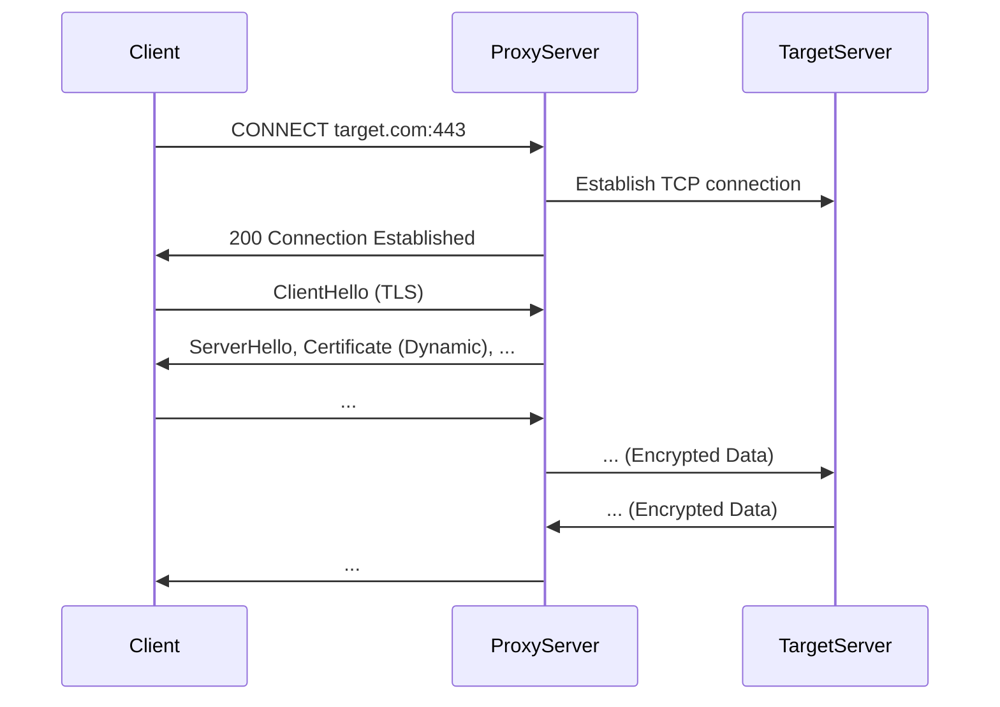
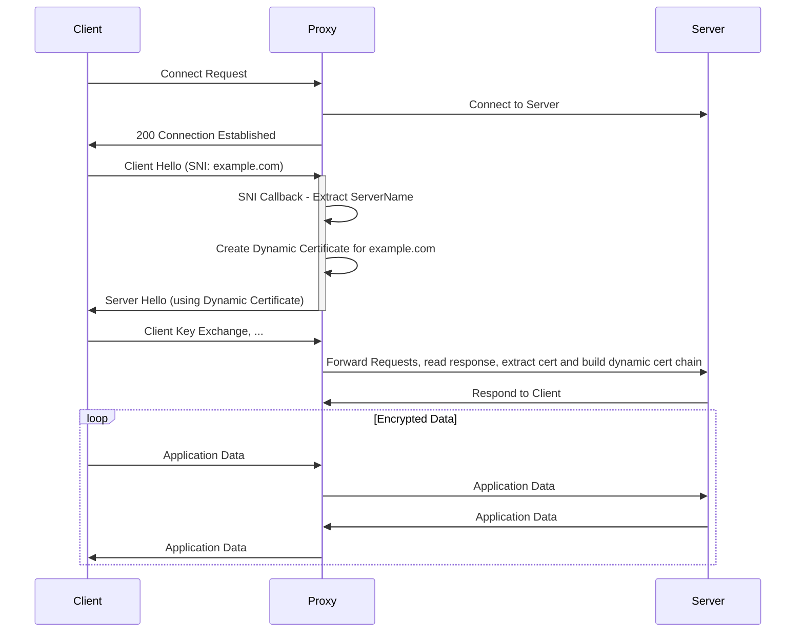

# Comprehensive Documentation

## Overall Overview:

The project is an HTTPS proxy server implemented in C++ using Windows IOCP (I/O Completion Ports) for asynchronous I/O operations. It intercepts HTTPS traffic between a client and a server, allowing for inspection and modification of the communication. The proxy supports both HTTP and HTTPS connections. For HTTPS, it dynamically generates certificates to perform a man-in-the-middle attack. The code uses OpenSSL for SSL/TLS encryption and decryption and spdlog for logging. The project also implements Windows service functionality, allowing the proxy to run in the background. The app.py file provides functionality to document using Gemini-2.0-flash to generate mark down files.

## File/Module-Level Details:

*   **`app.py` (Python)**:
    *   Responsible for generating comprehensive documentation using the Gemini-2.0-flash model. It retrieves existing documentation and code, chunks them, and creates a final prompt to generate the documentation, which is then saved to a Markdown file.
    *   Notable design decisions include chunking the code and documentation to handle token limits and using markers to chunk the code.
    *   Dependencies: `os`, `re`, `google.genai`.
*   **`IocpHttpsProxyServer.cpp` (C++)**:
    *   The main file containing the logic for the HTTPS proxy server. It initializes Winsock, OpenSSL, creates a completion port, listens for client connections, and handles HTTP/HTTPS traffic. This file also implements Windows service functionality.
    *   It uses IOCP for asynchronous I/O, OpenSSL for SSL/TLS functionality, and spdlog for logging.
    *   Dependencies: Windows headers, Winsock2, OpenSSL, spdlog.
*   **`IocpHttpsProxyServer.sln` (Visual Studio Solution)**:
    *   Visual Studio solution file that defines the project structure and build configurations.
    *   Contains information about the project's dependencies and build settings.
*   **`IocpHttpsProxyServer.vcxproj` (Visual Studio Project)**:
    *   Visual Studio project file that defines the project settings, such as compiler options, linker options, and source files.
    *   Specifies the project's dependencies and build configurations.
*   **`IocpHttpsProxyServer.vcxproj.filters` (Visual Studio Filters)**:
    *   Visual Studio filters file that organizes the source files into logical groups within the IDE.
    *   Provides a way to visually structure the project's source code.
*   **`SslUtil.h` (C++)**:
    *   Header file containing utility functions related to SSL/TLS operations, such as creating sockets, connecting to target servers, parsing CONNECT requests, extracting hostnames, generating private keys, configuring SSL contexts, and creating certificates.
    *   Dependencies: OpenSSL headers, Winsock2.
*   **`Util.h` (C++)**:
    *   Header file containing utility functions for initializing Winsock and OpenSSL, converting data to a hexadecimal string, and setting up SSL key logging and info callbacks.
    *   Dependencies: OpenSSL headers, Winsock2.

## Key Functions and Components:

*   **`app.py` functions:**
    *   `get_existing_docs()`: Reads the content of "demo.md" to retrieve existing documentation.
    *   `get_existing_code()`:  Walks through the directory, reads all code files based on file extensions and creates a string.
    *   `chunk_text()`: Splits a string into smaller chunks of a specified size.
    *   `chunk_code()`: Splits a code string into smaller chunks using the "# File:" marker.
    *   `create_final_prompt()`: Generates the final prompt from the chunks of documentation and code for Gemini.
    *   `generate_documentation()`: Calls the Gemini-2.0-flash model to generate comprehensive documentation from the given prompt.

*   **`StartProxyServer()` (C++)**:
    *   Main function to start the proxy server. It initializes Winsock, OpenSSL, creates a completion port, and listens for client connections.
    *   Sets up the root CA certificate and private key for generating dynamic certificates.
    *   Creates worker threads to handle client connections.
*   **`WorkerThread()` (C++)**:
    *   Worker thread function that handles I/O operations on client and server sockets.
    *   Uses `GetQueuedCompletionStatus` to wait for I/O completion events.
    *   Handles HTTP and HTTPS traffic using `WSARecv` and `WSASend`.
    *   Performs SSL/TLS handshake with the client and the target server.
*   **`UpdateIoCompletionPort()` (C++)**:
    *   Creates a `PER_IO_DATA` structure to store I/O operation data and associates it with the completion port.
    *   Initializes the `PER_IO_DATA` structure with client and server sockets, buffers, and SSL/TLS contexts.
*    **`ServerNameCallback()` (C++)**:
     *   SNI callback to extract the server name and create dynamic certs.

*   **`ServiceMain()` (C++)**:
    *   Service entry point, initializes the service and calls `StartProxyServer()`.
*   **`ServiceControlHandler()` (C++)**:
    *   Handles service control requests, such as stop and shutdown.
*   **`ServiceInstall()`, `ServiceDelete()`, `ServiceStart()`, `ServiceStop()` (C++)**:
    *   Functions for installing, deleting, starting, and stopping the Windows service.
*   **SSL Utility Functions (C++)**:
    *   `createSocket()`: Creates a socket for listening.
    *   `connectToTarget()`: Creates a socket and connects to the target server.
    *   `parseConnectRequest()`: Parses the CONNECT request to extract hostname and port.
    *   `extractHost()`: Extracts the host name from an HTTP request.
    *   `generatePrivateKey()`: Generates a private key using OpenSSL.
    *   `configureContext()`: Configures the SSL context with a certificate and private key.
    *   `create_certificate()`: Creates a new certificate signed by the CA.

## Implementation Details:

*   **Error Handling**:
    *   The code uses `WSAGetLastError()` to retrieve the error code for Winsock functions.
    *   OpenSSL errors are handled using `ERR_print_errors_fp(stderr)`.
    *   Error messages are logged using `spdlog`.
    *   The code checks the return values of functions and handles errors accordingly, for example, closesockets and deallocating memory.
*   **File Structure Conventions**:
    *   The project is structured into source files (`.cpp`) and header files (`.h`).
    *   SSL utility functions are located in `SslUtil.h` and `SslUtil.cpp`
    *   General utility functions are located in `Util.h`.
*   **Data Flows**:

    *   **HTTP Proxy**:
        1.  Client connects to the proxy server.
        2.  Proxy server accepts the connection.
        3.  Client sends an HTTP request.
        4.  Proxy server parses the request and connects to the target server.
        5.  Proxy server forwards the request to the target server.
        6.  Target server sends an HTTP response.
        7.  Proxy server forwards the response to the client.
    *   **HTTPS Proxy (CONNECT Tunneling)**:
        1.  Client connects to the proxy server.
        2.  Proxy server accepts the connection.
        3.  Client sends a CONNECT request.
        4.  Proxy server parses the request and connects to the target server.
        5.  Proxy server sends a "200 Connection Established" response to the client.
        6.  Client and target server negotiate an SSL/TLS connection through the tunnel.
        7.  Proxy server relays encrypted data between the client and the target server.
    *   **HTTPS Proxy (Man-in-the-Middle)**:
        1.  Client connects to the proxy server.
        2.  Proxy server accepts the connection.
        3.  Client sends a CONNECT request.
        4.  Proxy server parses the request and connects to the target server.
        5.  Proxy server extracts the hostname from ClientHello using SNI.
        6.  Proxy server generates a dynamic certificate for the hostname, signed by the CA.
        7.  Proxy server sends a "200 Connection Established" response to the client.
        8.  Proxy server presents the dynamic certificate to the client during the SSL/TLS handshake.
        9.  Proxy server decrypts and inspects the traffic between the client and the target server.

## Visual Diagrams:

### Data Flow (app.py)



### HTTP Proxy Data Flow



### HTTPS Proxy Data Flow (CONNECT Tunneling)



### HTTPS Proxy Data Flow (Man-in-the-Middle)



### Worker Thread Flow



### Service Installation Flow

```mermaid
graph LR
    A[Service Initialization - ServiceMain] --> B(Register Service Control Handler);
    B --> C(Report Service Status - SERVICE_START_PENDING);
    C --> D(Service Initialization - ServiceInit);
    D --> E(Report Service Status - SERVICE_RUNNING);
    E --> F(Start Proxy Server - StartProxyServer);
    F --> G(Wait for Service Events);
    G --> H(Cleanup Proxy Server - CleanupProxyServer);
    H --> I(Report Service Status - SERVICE_STOPPED);
```




### Sequence Diagram: HTTPS Connection



### Sequence Diagram: Client/Server Handshake with SNI


```mermaid
sequenceDiagram
    participant Client
    participant Proxy
    participant Server

    Client->>Proxy: HTTP/HTTPS Request
    Proxy->>Server: Forward request

    Server->>Proxy: Response Data
    Proxy->>Client: Forward response
